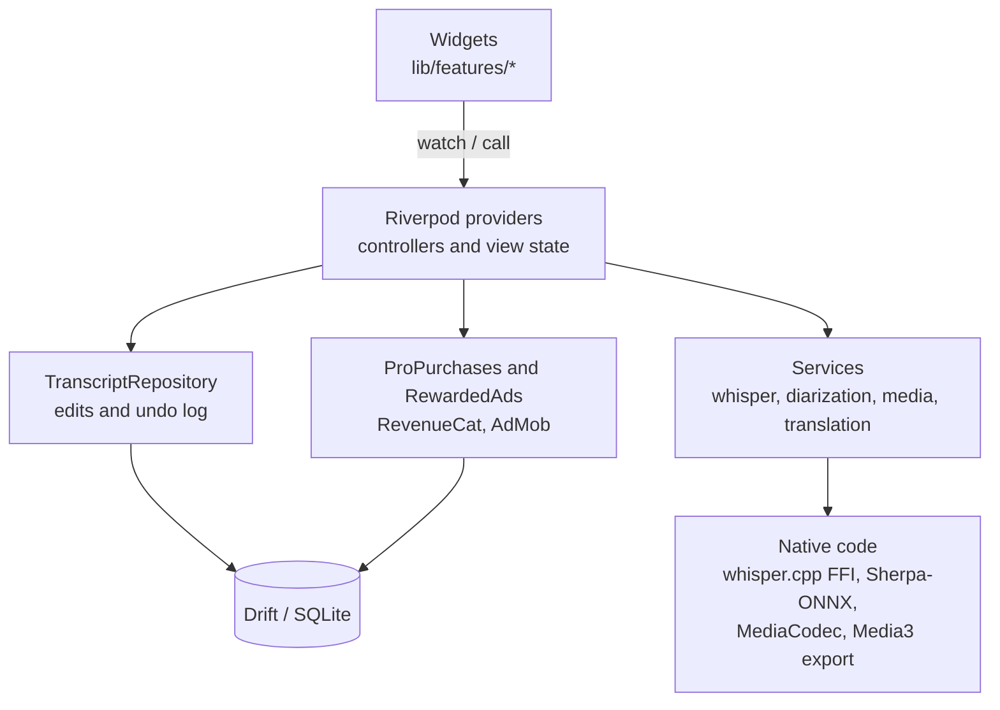

# Architecture

How the code is organised and where the main logic lives. The engines
themselves (whisper.cpp, Sherpa-ONNX, audio decoding) are covered in
[engine-architecture.md](engine-architecture.md).

## Pattern

The code is split by feature, with a shared `core/`, in an MVVM style:

- **Views** are Flutter widgets in `lib/features/`. They only display data and forward user actions.
- **View models** are Riverpod providers and notifiers (`@riverpod` code generation). They hold screen state and call into repositories and services.
- **Repositories and services** in `lib/core/` and `transcript_repository.dart` hold the business rules. They never import a widget.
- **Drift (SQLite)** is the single source of truth. Screens watch database streams, so an edit made anywhere shows up everywhere.

Pure rules live in plain Dart functions, with no Flutter or database, so host
tests can cover them: timeline placement, caption grouping, speaker
assignment, clip trimming. The app has about 775 host tests.



## Project layout

```
argand/
├── lib/
│   ├── main.dart                     start-up: loads theme and accent, starts RevenueCat and ads
│   ├── core/                         shared logic, no screens
│   │   ├── database/                 Drift tables, queries and migrations
│   │   ├── whisper/                  transcription service, model catalog and model info
│   │   ├── diarization/              speaker detection, assignment and refinement
│   │   ├── media/                    import, WAV conversion, thumbnails, share sheet
│   │   ├── audio/                    waveforms (and the parked denoiser)
│   │   ├── captions/                 grouping words into captions, SRT/VTT export
│   │   ├── timeline/                 pure timeline model: placement, trims, selection, zoom
│   │   ├── transcript/               edit events, sentence edits, speaker names and turns
│   │   ├── translation/              ML Kit translator behind a Translator interface
│   │   ├── delivery/                 model and language pack delivery
│   │   ├── monetization/             RevenueCat purchases, rewarded ads, watermark waiver
│   │   ├── video/                    export options and the export channel
│   │   └── theme/                    design system: colours, surfaces, controls, logo
│   ├── features/                     screens and their view models
│   │   ├── library/                  home screen, search and settings sheet
│   │   ├── transcription/            project editor: script mode, timeline, stage, export
│   │   ├── settings/                 model and language management pages
│   │   └── monetization/             paywall and thank-you page
│   └── l10n/                         UI strings (app_en.arb)
├── android/app/src/main/kotlin/      video export (Media3), thumbnails, launcher icons
├── packages/
│   ├── whisper_ggml_plus/            patched whisper.cpp plugin (changes marked // FORK:)
│   └── audio_decoder/                patched decoder plugin (HE-AAC fix)
├── assets/                           models, fonts, logo
├── test/                             host tests
└── integration_test/                 on-device tests and measurement probes
```

## Where key logic lives

| What | Where |
| --- | --- |
| RevenueCat setup, purchase, restore and entitlement check | `lib/core/monetization/purchases.dart` (`RevenueCatStore`, `ProPurchases`) |
| Paywall and thank-you screens | `lib/features/monetization/pro_screen.dart` |
| Is Pro unlocked (read by every gate) | `proUnlockedProvider` in `lib/core/monetization/monetization.dart` |
| Rewarded ad that removes the watermark for one export | `monetization.dart` (`SdkRewardedAds`, `FallbackRewardedAds`) and `admob_rewarded_source.dart` |
| Watermark decision at export | `claimProWaiver` / `WatermarkWaiver` in `monetization.dart`, used by `export_sheet.dart` |
| Transcription run | `lib/features/transcription/transcription_run.dart`, `lib/core/whisper/whisper_service.dart` |
| Import (copy, convert, transcribe, diarize) | `lib/features/transcription/import_controller.dart` |
| Every edit, with undo and redo | `transcript_repository.dart` and `timeline_history.dart` |
| Timeline arithmetic (clips end to end, trims, run length) | `lib/core/timeline/project_timeline.dart`, `clip_trim.dart` |
| Timeline UI and tools | `lib/features/transcription/timeline_screen.dart` |
| Moving and resizing items on the preview | `lib/features/transcription/stage_editor.dart` |
| Caption styles | `lib/features/transcription/style_panel.dart`, `lib/core/timeline/item_look.dart` |
| Video export | `video_export_controller.dart` in Dart, `VideoExportChannel.kt` on Android |
| Model downloads | `lib/core/delivery/`, `lib/features/settings/asset_packs_controller.dart` |

## Monetization flow

1. On start-up, `main.dart` starts `ProPurchases`, which configures RevenueCat with the key from `.env`.
2. The paywall asks `ProPurchases.offer()` for the lifetime package and its store price.
3. Buying or restoring goes through RevenueCat. Any active entitlement counts as Pro.
4. The result is saved locally as `pro.unlocked`, so Pro keeps working offline.
5. Every Pro check reads `proUnlockedProvider`. Pro removes the watermark and hides the ad option.

Without Pro, the export sheet offers a rewarded ad. Watching it to the end
returns a `WatermarkWaiver`, and only that type lets an export skip the
watermark.

## Data rules

- Every row has a UUID, `createdAt` and `updatedAt`, and is soft-deleted.
- Removing something from the timeline is an undoable edit and never deletes media. A project's media is deleted only when the project itself is deleted.
- Captions are never stored as pixels. They are grouped from word rows when read, and drawn into the video only at export.
